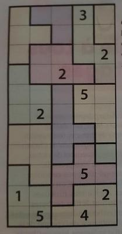

# Tectonic solver

*NB : here is a presentation of the problem and how it was solved. The code itself is a Jupyter notebook with a great amount and comments and notes making very explicit how the solution was implemented.*

## Game rules

Tectonic puzzles, also known as "Suguru" puzzles are grids made of **blocks**, each made of 1 to 5 **cells**, to be filled with numbers according to the following rules : 

- **Rule 1** : Each block of n cells, contains the digits 1 to n (once each)
- **Rule 2** : Adjacent cells cannot have the same number (including diagonally)

Example of a initial state of a grid : 



## Playing the game

Let's take the purple 3 cells block on top of the grid. Since it has 3 cells, we have to fill it with number 1, 2 and 3. And since adjacent cells cannot have the same number, we know number 3 will go on the 1st row, 2nd column.

Then for the yellow 4 cell block on top left of the grid, the only possible for the number 3 is 1st column, 3rd row.

By enforcing the rules for each cell and block, the user should be able to complete the grid without making any assumptions.


## Solving the grid digitally

### Method

To solve this grid, we'll use brute force and fill the cells one by one, following this basic protocol : 

* Step 1 : find the next empty cell
* Step 2 : fill the cell with next number (if cell is empty : 1, else cell number +1)
* Step 3 : does this number comply with rules 1 and 2 ?
  * YES --› go to step 1
  * NO --› is current number n ? (max of current block)
    * YES --› go back to the previously filled cell
    * NO --› go to step 2


This protocol says a lot about what we'll need to solve the problem :

* Define the grid, blocks and given numbers
* Know what is the next empty cell
* Know what was the previous cell filled
* Implement tests to check the enforcement of Rules 1 and 2, meaning that we need to know for each cell :
  * What block it belongs to
  * Who its adjacent cells are (and taking in account the cells on the edge of the grid)

### Implementation

* The grid is an array, each cell being identified with a column and row number. We first setup the problem by defining two arrays :
  * One describing what block (identified with a number) each cell belongs to
  * One with the given values
* The **Cell** class has the following parameters and methods : 
  * **Parameters** : own value, max value in its block, state, position in the grid, list of cells in its block, list of neighbors
  * **Methods** : initialization (sets position in the grid), implementation of game rules, implementation of the filling protocol
* Initialization :
  * Each cell in the grid is an instance of the Cell class ;
  * Each cell is given an initial value : either 0 or one of the given values ;
  * Each cell is given a list of the adjacent cells ;
  * Each cell is given a block number and a list of cells belonging to the same block
* Filling function : the **fill()** function from the **Cell** class implements the protocol previously described, and depending the outcome will return one of these 3 values : 
  * 1 : the cell was successfully filled
  * 0 : the cell could not be filled, the next number should be tried
  * -1 : the cell could not be filled and the max possible number was reached

### Filling the grid

Starting with the first empty cell, and until the last empty cell is filled with a number complying with the game rules, the algorithm will ask each cell to fill itself and depending on the outcome will : 

* Go to the next empty cell
* Stay on the current cell and try the next number
* Set the cell number to 0 and go back to the previous cell

### Following the steps

The algorithm has is 'verbose' so that we can follow the steps. 

Let's discuss the following example : 

```
STEP 48
ActiveCell : 1,2, active i : 7, value : 1
Cell : adding one
Cell : max not reached, new value : 2, new state : notmax
Cell : test failed, we'll stay here
```

* The active cell is 2nd row, 3rd column (1 ; 2). Its value is 1. 
* Algorithm adds 1
* Algorithm checks if the max value for this block is reached (it is not) and then sets the new value to 2, and the status to `notmax`. 
* Algorithm tests rules 1 and 2 and failed 

The next step (49) is similar, but this time after adding one the max is reached! 

```
STEP 49
ActiveCell : 1,2, active i : 7, value : 2
Cell : adding one
Cell : max reached, new value : 3, new state : maxed
Cell : test failed, we'll stay here
```

On step 50 the algorithm faces the `maxed` state, sets the value to  0 and orders to go back one cell

```
STEP 50
ActiveCell : 1,2, active i : 7, value : 3
Cell : maxed. Set to 0 and go back!
Cell : new value 0, new status notmax
```

Step 51 shows that we are now dealing with line 2, column 2 (1 ; 1), and is similar to step 49 : the max is reached!

```
STEP 51
ActiveCell : 1,1, active i : 6, value : 3
Cell : adding one
Cell : max reached, new value : 4, new state : maxed
Cell : test failed, we'll stay here
```

Steps 52 to 56 are very interesting : we keep going back to cells whose maxes have been reached, with the exception of step 55 where cell (0 ; 3) is a fixed value (see grid on top : 1st row, 4th column : the given value is 3).

```
STEP 52
ActiveCell : 1,1, active i : 6, value : 4
Cell : maxed. Set to 0 and go back!
Cell : new value 0, new status notmax
STEP 53
ActiveCell : 1,0, active i : 5, value : 4
Cell : maxed. Set to 0 and go back!
Cell : new value 0, new status notmax
STEP 54
ActiveCell : 0,4, active i : 4, value : 2
Cell : maxed. Set to 0 and go back!
Cell : new value 0, new status notmax
STEP 55
ActiveCell : 0,3, active i : 3, value : 3
Cell : value not changed : 3
Cell : fixed. Keep going backward!
STEP 56
ActiveCell : 0,2, active i : 2, value : 1
Cell : adding one
Cell : max not reached, new value : 2, new state : notmax
Cell : test failed, we'll stay here
```

### End of the algorithm

The algorithm ends when the last empty cell is filled with a number complying with the game rules. This grid took 3318 steps to solve and needed to go back 584 times. The execution time in verbose mode (writing details for each step) is 1.4 sec, but only 5 milliseconds without the comments.

The solved grid is displayed as an array : 

```
array([[1., 3., 1., 3., 2.],
       [2., 4., 2., 4., 1.],
       [3., 1., 3., 5., 2.],
       [4., 5., 2., 4., 1.],
       [3., 1., 3., 5., 3.],
       [5., 2., 4., 2., 1.],
       [1., 3., 1., 5., 4.],
       [2., 4., 2., 3., 1.],
       [3., 5., 1., 5., 4.],
       [1., 4., 2., 3., 2.],
       [2., 5., 1., 4., 5.]])
```
